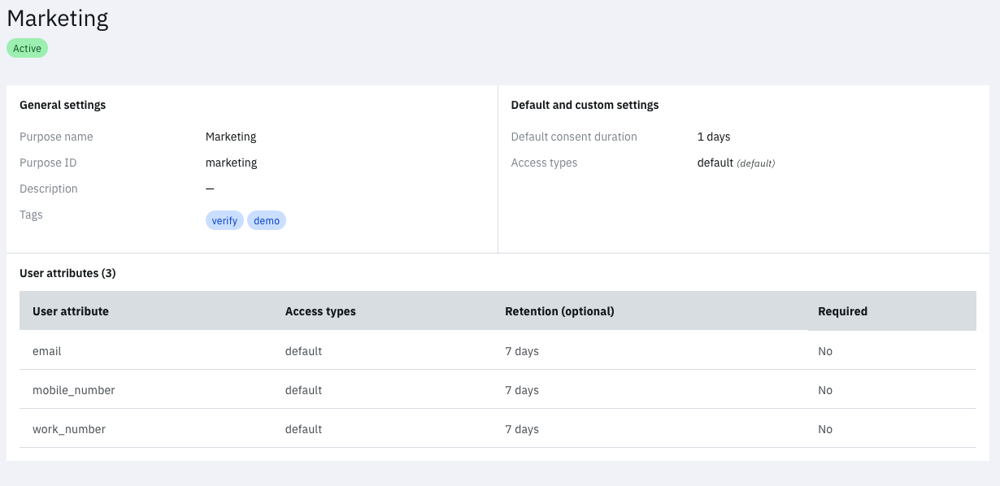
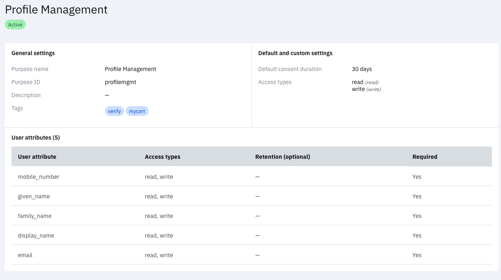
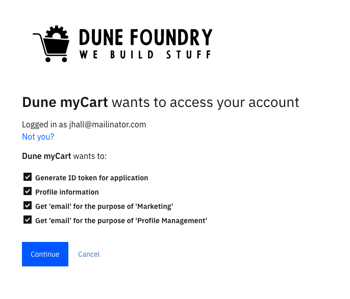
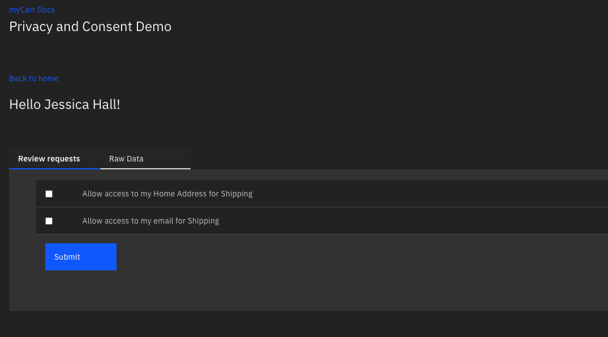

# Dune Privacy Demo

Use this application to configure your an OIDC application that illustrates purpose-aware OAuth scopes and native purpose-aware consent. The application is built with Node.js, the [Verify OAuth SDK](https://www.npmjs.com/package/ibm-verify-sdk) and the [Verify Privacy SDK](https://github.com/vivshankar/verify-dpcm-sdk-js/). All UI assets can be found under [views](/views) and [public](/public). All views are written using vanilla HTML and JS and templated using Handlebars.

This application uses IBM Security Verify as the identity provider to illustrate the capabilities.

In this app, you can do the following -

- Authenticating the client using IBM Security Verify with one or more purpose-aware scopes
- Viewing the authenticated user's profile by unpacking the id_token
- Simulating a shopping cart consent experience, where the user's email and address is requested as part of the checkout process for the purpose of shipping purchases.

## Pre-requisites

1. Install Node and Git on your machine
2. [Create a tenant on IBM Security Verify](https://docs.verify.ibm.com/verify/docs/signing-up-for-a-free-trial)
3. Clone this repo to your machine

## Setup

### Admin: Create attributes

1. Login to IBM Security Verify admin console (https://yourtenant.verify.ibm.com/ui/admin) using admin

2. Go to `Configuration > Attributes`

3. Add a new custom attribute with the ID `home_address`. When saved, it should look like this.
    

### Admin/Privacy Officer: Add data privacy items

1. Login to IBM Security Verify admin console (https://yourtenant.verify.ibm.com/ui/admin) using admin or privacy officer credentials

2. Go to `Data privacy & consent > Purposes`

3. Add purpose with ID `marketing` and 3 user attributes - email, mobile_number and work_number. Set access type as `default`. When saved and published, it should look like this.

    

4. Add purpose with ID `profilemgmt` and 5 user attributes - mobile_number, given_name, family_name, display_name, email. Create two new access types during the creation of the purpose with the ID `read` and `write`. When saved and published, it should look like this.
    
    

5. Add purpose with ID `shipping` and 3 user attributes - Home Address, mobile_number, email. Set access type as `default`. When saved and published, it should look like this.
    
    

### Admin: Create an application

1. Login to IBM Security Verify admin console (https://yourtenant.verify.ibm.com/ui/admin) using admin credentials

2. Go to `Applications`

3. Click on `Add Application` and add a `Custom Application`

4. Fill in the name of the application etc. in the General tab.

5. Switch to the `Sign On` tab and choose `Open ID Connect` as the Sign-on method.

6. Enter an application URL. If you are running this app locally, use `http://localhost:3000`

7. Verify that `Authorization code` is selected the grant type

8. Uncheck `Require proof key for code exchange (PKCE) verification`.

9. Add the redirect URI as `http://localhost:3000/auth/callback` if you are running this locally. If you hosting this somewhere, replace the hostname and protocol as appropriate.

10. Click Save.

11. In the Entitlements tab, choose `Automatic access for all users and groups`. Click Save.

12. In the Privacy tab, add the Marketing, Profile Management and Shipping purposes.

### Setup the application

1. Copy the dotenv file and name the new file `.env`.

2. Change the `TENANT_URL`, `ClIENT_ID` and `CLIENT_SECRET`. The client ID and secret are obtained from the application that was created in the previous section.

### Run the application

1. Install node dependencies

    ```bash
    npm install
    ```

2. Run the application. You should see `Server started and listening on port 3000` after executing the command below.

    ```bash
    npm start
    ```

3. Open the browser and go to http://localhost:3000 and you should be able to use the application

4. If everything is correctly setup, you should be redirected to authenticate with your tenant. On authentication, you should be presented with a consent page as below. This demonstrates the OAuth integration using the special format of the `scope` (see the `SCOPE` in the .env file).

    

5. Click on `Cart` once you login and you should see a consent prompt for shipping purpose. This demonstrates the native integration with APIs.

    